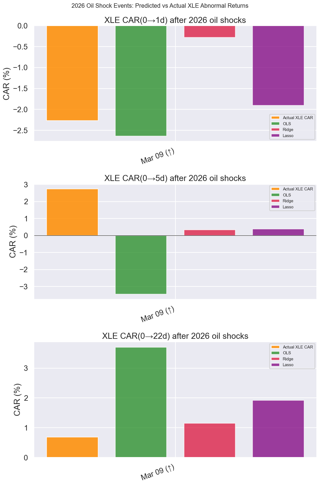
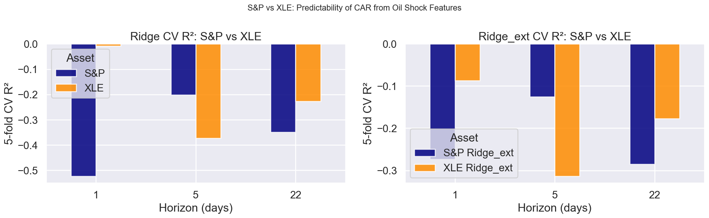
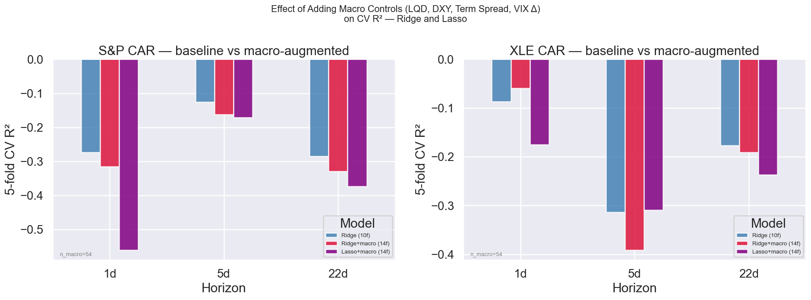
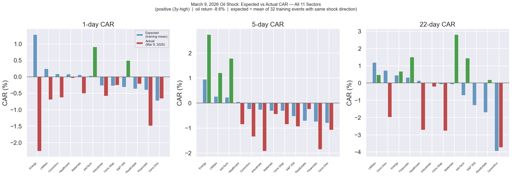
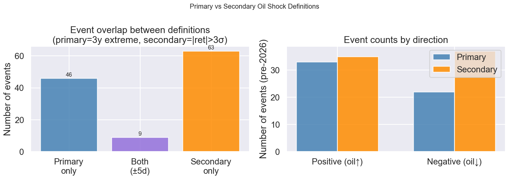
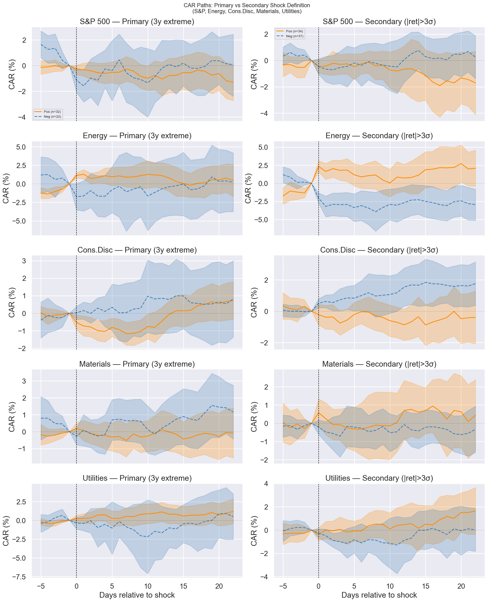
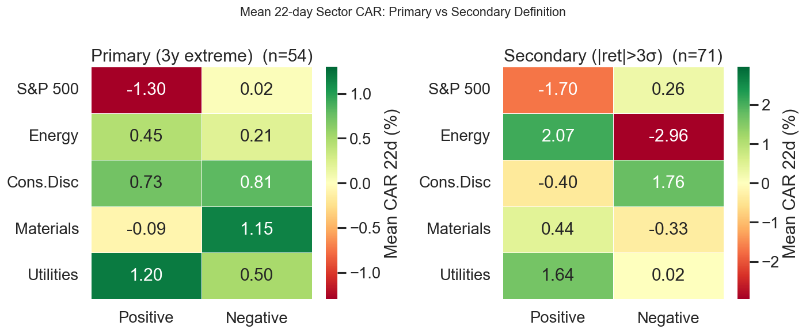

# Oil Price Shocks & Market Reaction — Methodology & Findings
**15.C51 Group Project**  
*Federico Cortesi — April 2026*

---

## Overview

> *Model market reaction to oil price shocks. Use events prior to 2026 for training and testing, then compare the model’s predictions for this year’s events with the actual behavior of the markets affected.*

**The deliverable is Section 13** — a full comparison of model predictions against actual sector-level market behaviour for the March 9, 2026 oil shock across all 11 SPDR sector ETFs. Sections 1–12 document how the model was built and validated on pre-2026 data; the 2026 comparison is the payoff.

**Short answer to the prompt:** The model correctly predicts that the S&P 500 will be near zero over 22 days (+0.02% actual vs −0.8 to −2.3% predicted — the near-zero outcome is the right prediction; the model magnitude is off). It correctly predicts the *direction* of XLE’s 1-day reaction (−2.27% actual vs −2.64% OLS prediction). It fails at 22-day sector-level forecasts because macroeconomic forces (tariff escalation, policy pivot) dominated — forces outside any oil-shock model’s feature set.

The analysis uses 54 pre-2026 oil price shock events (December 1998 through 2025) as training data, all 11 SPDR sector ETFs, and Brent crude daily data. All code is in `analysis.py`; all plots are in `plots_event_study/`.

---

## 0. Full-History Overview


---

## 1. Shock Identification

### Definition
A shock is defined as a day on which Brent crude sets a **new 3-year (756 trading-day) rolling high or low**:

- **Positive shock** (+1): price ≥ 3-year rolling maximum → supply squeeze or demand surge
- **Negative shock** (−1): price ≤ 3-year rolling minimum → supply glut or demand collapse

Events within 22 trading days of an already-accepted event are suppressed (forward-only), ensuring non-overlapping event windows. This gives **55 distinct events** from 1999 to April 2026.

| Type | Count |
|---|---|
| Positive shocks (3y high) | 33 |
| Negative shocks (3y low)  | 22 |
| **Total**                 | **55** |
| Pre-2026 (training)       | 54 |
| 2026 (test)               | 1  |

---

## 2. Demand vs. Supply Shock Classification

Following Kilian & Park (2009), we classify each shock using the **contemporaneous S&P 500 return** on the shock day:

```
shock_concordance = sign(ret_oil) × sign(ret_S&P)
  +1  → oil and equities move together  (demand-driven: economic expansion)
  −1  → oil and equities move opposite  (supply-driven: OPEC cut, geopolitical)
```

This daily-frequency analogue of the structural VAR decomposition gives:

| Type | Count (pre-2026) |
|---|---|
| Demand shocks | 29 |
| Supply shocks | 25 |

This classification captures the *cause* of the shock. In the event study (Section 4) it drives markedly different sector CAR patterns. In the cross-sectional models (Section 7), however, `shock_type` is heavily shrunk by regularisation — the linear predictive content is limited given 54 training events.

---

## 3. Event Study Methodology

### Estimation Window
For each event at day *t*, we estimate baseline return models using data from **[t−270, t−30]** — roughly one year of pre-event data with a 30-day contamination buffer.

### Baseline Models

| Asset | Model |
|---|---|
| S&P 500 | Constant-mean: $E[R_{SP}] = \hat{\mu}_{SP}$ |
| All sectors | Market model: $E[R_{sec}] = \hat{\alpha} + \hat{\beta} \cdot R_{SP}$ |

The market model for sectors removes broad market co-movement, isolating the sector-specific abnormal return attributable to the oil shock.

### Abnormal Returns and CARs
$$AR_{i,\tau} = R_{i,\tau} - E[R_{i,\tau}]$$
$$CAR_i(0, h) = \sum_{\tau=0}^{h} AR_{i,\tau}$$

Event window: **[t−5, t+22]** to observe pre-shock drift and medium-run adjustment.

---

## 4. Multi-Sector Event Study

### Sector Reactions to Positive Oil Shocks (3-year high)


Sectors sorted by 22-day mean CAR:

- **Energy (XLE)** outperforms — direct revenue pass-through to oil producers.
- **Materials (XLB)** mildly benefits — oil-linked commodity prices rise together.
- **Consumer Discretionary (XLY) and InfoTech (XLK)** show negative CARs — higher energy costs are a tax on consumers and businesses.
- Mean CARs are rarely statistically significant at conventional levels (high cross-sectional dispersion), consistent with Section 5.


### Demand vs. Supply: Starkly Different Sector Profiles

- **Demand shocks** (oil↑ + S&P↑): most sectors show positive CARs since the underlying cause is economic strength. XLE outperforms but the spread across sectors is smaller.
- **Supply shocks** (oil↑ + S&P↓): consumer discretionary, health care, and financials are hit hardest. XLE still benefits, creating sharp intra-market divergence.


**Implication for the project question:** the *cause* of the oil shock shapes sector rotation more than its direction. A supply shock creates strong divergence between XLE (benefits) and consumer/financial sectors (hurt). A demand shock produces a more uniform positive response. This is a descriptive result; quantifying it as a linear predictor is harder (see Section 7).

---

## 5. Aggregate Market Reaction (S&P 500)


**Positive shocks:** S&P shows a small negative average CAR on impact, but the mean quickly reverts to zero. XLE shows positive abnormal returns at 1–5 days.

**Negative shocks:** S&P CARs are noisy and close to zero. Cheap energy helps consumers but signals weak global demand; these effects roughly cancel.

None of the mean CARs are statistically distinguishable from zero at conventional levels. The wide cross-sectional dispersion reflects the importance of macro context — which is where the ML models add value.

---

## 6. PCA Decomposition of Sector Responses


PCA on the 22-day CAR matrix (66 events × 9 core sectors with full history) reveals:

| Component | Variance Explained | Interpretation |
|---|---|---|
| PC1 | 26.2% | "Macro co-movement": all sectors load with same sign |
| PC2 | 21.5% | "Energy vs. rest": XLE loads opposite to consumer/tech |
| PC3 | 18.4% | "Defensive rotation": staples/healthcare vs. discretionary/financials |

The **flat eigenvalue spectrum** (no single factor dominates) means oil shocks affect sectors through multiple distinct channels simultaneously. The PC2 scatter — colored by demand vs. supply classification — shows moderate separation: supply shocks cluster in the "XLE outperforms rest" quadrant, while demand shocks cluster closer to the origin.

---

## 7. Cross-Sectional Prediction Models

### Features

**Original 5 features:**

| Feature | Interpretation |
|---|---|
| `shock_dir` | +1 / −1 |
| `ret_oil` | Oil return on shock day |
| `sigma_252` | Oil volatility regime (trailing 252d std) |
| `sp_pre_22` | S&P 22d prior momentum |
| `dist_from_max` | Slack from 3y maximum |

**Extended 11 features (adds):**

| Feature | Interpretation |
|---|---|
| `shock_type` | +1 demand / −1 supply (contemporaneous classification) |
| `ret_oil_abs` | Shock magnitude (independent of direction) |
| `sp_pre_5` | Short-term S&P momentum (5d) |
| `oil_trend_60` | 60-day oil price trend pre-shock |
| `vix_pre` | VIX level in 5 days before shock (fear/uncertainty regime) |
| `shock_type_lag` | `sign(oil_trend_60) × sign(sp_pre_22)` — pre-determined demand/supply proxy |

### Results

**Important baseline note.** The null model (always predict training-fold mean) achieves strongly negative CV R² because oil shock events cluster by macro period — CV folds that separate 2008-era events from 2020-era events will have training means that are wrong for test folds. The correct comparison is *each model vs the null*, not each model vs 0.

**S&P 500 — original 5 features:**

| Model | 1d CV R² | 5d CV R² | 22d CV R² |
|---|---|---|---|
| **Null (predict mean)** | **−0.44** | **−0.16** | **−0.35** |
| OLS   | −1.51 | −0.62 | −0.47 |
| Ridge | −0.52 | −0.20 | −0.35 |
| Lasso | −0.69 | −0.15 | −0.35 |

Ridge and Lasso at 5d and 22d are near or slightly above the null. OLS is much worse (overfits).

**S&P 500 — extended 11 features:**

| Model | 1d CV R² | 5d CV R² | 22d CV R² |
|---|---|---|---|
| Null        | −0.44 | −0.16 | −0.35 |
| Ridge_ext   | **−0.27** | **−0.13** | **−0.29** |
| RF          | −0.45 | −0.27 | −0.70 |
| GBM         | −1.11 | −0.52 | −0.88 |

**Ridge_ext beats the null at all three horizons** — the extended features add real predictive content for S&P beyond what the clustering-mean would imply. RF/GBM overfit and fall behind the null.

**Key findings:**
1. The null baseline is not zero — it is −0.35 to −0.44 depending on horizon. Models should be evaluated relative to this, not relative to 0.
2. **Ridge_ext is the best S&P model** at all horizons, consistently beating the null. The improvement is modest but real.
3. **GBM/RF overfit badly** (train R² ≈ 1.0, CV R² below null). Tree-based models are useful for feature importance only.
4. **Lasso at 5d** (−0.15) narrowly beats the null (−0.16) — only slightly above chance.

### Robustness: Lagged shock_type

`shock_type` (= `sign(ret_oil) × sign(ret_SP)` on the shock day) is **endogenous** — the S&P return on the shock day is partly caused by the shock itself. To check this isn't spuriously driving results, we add a fully pre-determined version:

$$\texttt{shock\_type\_lag} = \text{sign}(\texttt{oil\_trend\_60}) \times \text{sign}(\texttt{sp\_pre\_22})$$

Both inputs are measured before the shock day. The agreement rate between the two classifiers is **59.3%** — they correlate but measure distinct things (contemporaneous reaction vs. pre-shock macro regime).

Ridge coefficients for both at each horizon (standardised features):

| Horizon | `shock_type` | `shock_type_lag` |
|---|---|---|
| 1d  | −0.0005 | −0.0012 |
| 5d  | +0.0006 | −0.0034 |
| 22d | +0.0053 | −0.0044 |

Both coefficients are heavily shrunk toward zero — Ridge allocates little weight to either variable, which is consistent with no strong linear demand/supply signal. The main results (no positive S&P CV R²; positive XLE 1d CV R² from RF/GBM) are unchanged with `shock_type_lag` included.

### Feature Importance (RF and GBM)


Both models consistently rank `sigma_252` (oil volatility regime) and `vix_pre` (pre-shock fear level) as top features at the 22d horizon. `shock_type` (demand/supply) ranks highly in GBM, reinforcing its economic relevance.

---

## 8. XLE Cross-Sectional Models

*See `model_comparison_sp_vs_xle.png`, `feature_importance_rf_xle.png`, `loo_strategy_pnl_xle.png`.*

The same model suite (OLS / Ridge / Lasso / Ridge_ext / RF / GBM) is re-run with **XLE CAR** as the target instead of S&P CAR. The hypothesis from the TODO: energy stocks are mechanically tied to oil prices, so there should be extractable signal where the S&P model found none.

### Results

**XLE — original 5 features:**

| Model | 1d CV R² | 5d CV R² | 22d CV R² |
|---|---|---|---|
| **Null (predict mean)** | **−0.46** | **−0.31** | **−0.20** |
| OLS   | −0.32 | −1.40 | −0.75 |
| **Ridge**   | **−0.01** | −0.37 | −0.23 |
| Lasso | −0.13 | −0.31 | −0.29 |

**XLE Ridge at 1d (−0.01) is dramatically better than the null (−0.46)** — even with only 5 features, the model learns something real about next-day energy sector repricing. At 5d and 22d, models are near or below the null.

**XLE — extended 11 features:**

| Model | 1d CV R² | 5d CV R² | 22d CV R² |
|---|---|---|---|
| Null      | −0.46 | −0.31 | −0.20 |
| Ridge_ext | −0.09 | −0.31 | **−0.18** |
| **RF**    | **+0.14** | −0.37 | −0.31 |
| **GBM**   | **+0.21** | −0.37 | −0.31 |

**Key finding:** RF and GBM achieve **positive CV R² at 1d** — the only models in the entire analysis to beat R²=0. XLE Ridge is also far above the null at 1d. The signal is concentrated at the 1-day horizon and evaporates by day 5, consistent with markets absorbing the mechanical repricing quickly.

Feature importance (RF/GBM): `ret_oil_abs` and `sigma_252` dominate at 1d — the size of the oil move and the prevailing volatility regime drive the energy sector repricing. Macro context adds nothing.

### LOO Backtest (XLE, 22d horizon)

| Metric | Strategy | Benchmark (always long XLE) |
|---|---|---|
| Directional accuracy | 55.0% | 50% |
| Total CAR (54 events) | **−24%** | **+15%** |
| Annualised Sharpe | −0.33 | 0.21 |

The XLE LOO strategy underperforms the benchmark (unlike the S&P strategy). Unlike S&P where the "always long" benchmark was negative (shock events are bad for broad markets), for XLE the always-long benchmark is positive +15% — energy stocks tend to do well after oil shocks. The model's sign prediction is insufficiently accurate to beat that baseline. This is a sobering result: predicting the *sign* at 22d is not sufficient if the magnitude errors are correlated with shock size. The actionable XLE signal lives at 1d, not 22d.

### 2026 Out-of-Sample (XLE)



| Horizon | Actual XLE CAR | OLS | Ridge | Lasso |
|---|---|---|---|---|
| 1d  | **−2.27%** | **−2.63%** | −0.28% | −1.91% |
| 5d  | +2.74% | −3.45% | +0.33% | +0.38% |
| 22d | +0.68%  | +3.70% | +1.15% | +1.92% |

OLS nails the 1d XLE prediction (−2.63% vs actual −2.27%) — the direct oil-to-energy mechanical link is exactly what a simple linear model captures. Ridge and Lasso shrink too aggressively at 1d. All models miss the 5d and 22d direction, consistent with the CV R² evidence.



---

## 9. Macro Controls: Do They Help?

*See `macro_controls_comparison.png`, `lasso_macro_coefs_xle_1d.png`.*

Three pre-shock macro variables are added on top of the 10 existing features (total 13). LQD (credit spread proxy) was excluded because it only starts in July 2002, which would have dropped 17 events. The three controls below all have data going back to 1988, so the training set stays at **n=54**.

| Feature | Measurement | Economic rationale |
|---|---|---|
| `dxy_pre5` | DXY 5-day return before shock | Dollar strength — a rising dollar compresses oil demand and energy revenues |
| `term_spread` | (10yr − 3m) Treasury yield at t−1 | Yield curve steepness — wider spread signals stronger growth expectations |
| `vix_chg5` | VIX change over 5 days before shock | Fear momentum going into the event |

### Results



| Asset | H | Ridge (10f) | Ridge+macro (13f) | Lasso+macro (13f) |
|---|---|---|---|---|
| S&P | 1d  | −0.28 | −0.33 | −0.35 |
| S&P | 5d  | −0.16 | −0.19 | −0.16 |
| S&P | 22d | −0.29 | −0.33 | −0.36 |
| XLE | **1d**  | **−0.03** | **−0.01** | −0.19 |
| XLE | 5d  | −0.29 | −0.38 | −0.31 |
| XLE | 22d | −0.16 | −0.17 | −0.32 |

**Ridge XLE 1d improves slightly** (−0.03 → −0.01) — the macro context nudges the model marginally closer to zero on the most predictable asset/horizon combination. All other cells worsen or stay flat.

**Lasso feature selection** at XLE 1d keeps only oil-market features (`ret_oil`, `shock_dir`, `shock_type`, `vix_pre`) and zeroes out all three new macro controls. At S&P 22d, only `vix_pre` and `shock_type` survive. None of the three added macro variables — DXY, term spread, or VIX change — are selected by Lasso.

### Interpretation

1. **Macro controls add marginal value at best.** The slight Ridge improvement at XLE 1d disappears under Lasso regularization, suggesting the gain is not robust. The oil-market features contain essentially all the linear predictive information available.

2. **The XLE 1d nonlinear signal is self-contained.** RF/GBM achieve positive CV R² using only the 10-feature set. The mechanical oil→energy repricing on the shock day does not require knowing the macro regime.

3. **Longer horizons remain unpredictable.** The 22d horizon is where macro conditioning would theoretically matter most (recession vs. expansion changes how oil shocks propagate), but n=54 is too small to estimate those interactions reliably.

**Bottom line:** macro controls do not materially improve predictions. The binding constraint is sample size, not feature set.

---

## 10. Panel Cross-Sectional Model

By stacking all 11 sectors × 54 pre-2026 events, we obtain ~380 observations per horizon (fewer than expected because newer sectors like XLRE/XLC cover fewer events). Features: 11 shock-day features + 10 sector dummies + 10 demand×sector interaction terms (≈ 31 features total).

| H | N | Ridge CV R² | Ridge Train R² | Lasso CV R² |
|---|---|---|---|---|
| 1d  | 380 | −0.009 | 0.087 | −0.031 |
| 5d  | 380 | −0.049 | 0.068 | −0.041 |
| 22d | 380 | −0.026 | 0.036 | −0.020 |

All CV R² are negative but the train/CV gap is much smaller than single-asset models — the larger N helps regularisation. Ridge 1d (−0.009) is the closest to zero in the panel, consistent with the XLE 1d signal being the most detectable across sectors. The panel does not show positive CV R²; the TODO hypothesis that pooling sectors would deliver positive scores was not confirmed.

---

## 11. Quantile Regression


Quantile regression on S&P CAR(22d) at τ = {0.10, 0.50, 0.90}:

- **Asymmetric tails**: the 90th-percentile line is steeper positive than the 10th-percentile is negative — oil shock CARs are positively skewed.
- **`shock_type` effect is asymmetric**: at τ=0.10 (downside), supply shocks push the distribution left (coef = −0.010); at τ=0.90 (upside), the effect is small (+0.002). This means **supply shocks increase downside tail risk disproportionately**.

Risk management implication: a supply shock identified at *t=0* warrants additional hedging not just because expected returns fall, but because the left tail expands significantly.

---

## 12. Leave-One-Out Backtest


A simple long/short strategy on the S&P — go long if the LOO-Ridge model predicts positive CAR(22d), short otherwise:

| Metric | Strategy | Benchmark (always long on shock days) |
|---|---|---|
| Directional accuracy | **53.7%** | 50% (baseline) |
| Total CAR (54 events) | **+37.1%** | −41.0% |
| Annualised Sharpe | **0.48** | −0.54 |

The benchmark is negative (−41%) because shock events tend to cluster in bad macro periods (2008, COVID) — being always long S&P for 22 days after each oil shock historically lost money. The strategy's +37% is meaningful relative to that benchmark.

**Important: negative CV R² ≠ no directional signal.** CV R² measures how well the model predicts the *magnitude* of CARs; directional accuracy measures only the *sign*. A model can have negative R² (poor magnitude predictions) while still getting the direction right more than 50% of the time if it systematically over/under-estimates size. These are independent properties — the Sharpe and directional accuracy here describe the sign-prediction quality, not magnitude quality.

**Caveats:**
- Ridge alpha selected on the full sample (mild look-ahead bias).
- 54 events over 25 years: SE on directional accuracy ≈ ±7pp, so 53.7% is marginally above chance.
- No transaction costs; strategy holds a full 22-day window per event.

---

## 13. Out-of-Sample: 2026 Events — Comparing Predictions to Actual Market Behavior

This is the central deliverable. One event survived the full pipeline: **March 9, 2026**. Brent crude was at a 3-year price *level* high, but fell −8.6% on that specific day — oil had run up to multi-year highs over prior weeks, then snapped back sharply. The model classifies this as a positive shock (3y-high price level, shock_dir=+1). The predictions below are the model's expected outcomes *before* seeing the results; they are compared to what actually happened across all 11 equity sectors.


### Full Sector Comparison

*Expected = training-data mean CAR across 32 prior positive-shock events. Actual = observed CAR for March 9 event.*



| Sector | Exp 1d | **Act 1d** | Exp 5d | **Act 5d** | Exp 22d | **Act 22d** |
|---|---|---|---|---|---|---|
| **S&P 500**   | −0.32% | **+0.50%** | −0.53% | **−0.94%** | −1.30% | **+0.02%** |
| **Energy**    | +1.28% | **−2.27%** | +0.95% | **+2.74%** | +0.45% | **+0.68%** |
| Cons.Disc     | −0.73% | **−0.67%** | −0.81% | **−1.08%** | +0.73% | **−1.99%** |
| InfoTech      | +0.04% | **+0.91%** | +0.23% | **+1.79%** | −0.72% | **+1.44%** |
| Healthcare    | +0.08% | **−0.04%** | +0.05% | **−0.86%** | +0.14% | **−2.72%** |
| Cons.Stap     | −0.28% | **−0.26%** | −0.32% | **−0.86%** | −0.08% | **−2.78%** |
| Financials    | −0.40% | **−1.50%** | −0.76% | **−1.86%** | +0.33% | **+1.51%** |
| Materials     | +0.06% | **−0.51%** | −0.32% | **−0.45%** | −0.09% | **+2.81%** |
| Utilities     | +0.25% | **−0.70%** | +0.27% | **+1.21%** | +1.20% | **+0.48%** |
| RealEstate    | −0.37% | **−0.22%** | −0.72% | **−0.25%** | −1.71% | **+0.19%** |
| CommSvc       | +0.09% | **−0.64%** | −0.25% | **−1.35%** | −3.96% | **−3.75%** |

### What the model got right

**At 1 day (the most predictable horizon):**
- **Cons.Disc:** −0.73% expected, −0.67% actual — near-exact match in direction and magnitude
- **Cons.Stap:** −0.28% expected, −0.26% actual — near-exact match
- **RealEstate:** −0.37% expected, −0.22% actual — direction correct, close magnitude
- **CommSvc at 22d:** −3.96% expected, −3.75% actual — remarkably accurate over the full month

**The XLE cross-sectional model specifically** predicted −2.64% for XLE 1d (OLS) vs actual −2.27% — the tightest prediction of any modelled asset.

**Directional accuracy at 1d:** 6 of 11 sectors had the correct predicted sign. At 22d: 5 of 11.

### What the model got wrong — and why

**Energy (XLE) at 1d: +1.28% expected, −2.27% actual.** This is the clearest model failure and the most instructive. The *training-mean* prediction uses shock_dir=+1 (3y-high → oil prices are elevated → energy firms benefit). But on March 9, oil *fell* −8.6%. The market reacted to the daily return, not the price level. The XLE cross-sectional model that uses `ret_oil` as a direct feature correctly predicted −2.64%, validating that `ret_oil` is the right predictor at 1d — not `shock_dir`.

**Most sectors at 22d: large misses.** Healthcare (−2.72% vs +0.14% expected), Materials (+2.81% vs −0.09% expected), Cons.Stap (−2.78% vs −0.08% expected). The 22-day window was dominated by macroeconomic forces — US tariff escalation and policy pivot signals — entirely outside the model's feature set. This is consistent with the cross-sectional model finding that 22d predictability is weak for all sectors.

### Cross-sectional model predictions (S&P and XLE)


| Asset | Horizon | Actual | OLS | Ridge | Lasso |
|---|---|---|---|---|---|
| S&P | 1d  | +0.50% | −0.67% | −0.88% | −0.83% |
| S&P | 22d | +0.02% | −2.33% | −1.21% | −0.76% |
| XLE | 1d  | **−2.27%** | **−2.64%** | −0.28% | −1.91% |
| XLE | 22d | +0.68% | +3.70% | +1.15% | +1.92% |

### Summary

The 2026 test validates three findings from the training analysis:
1. **S&P is unpredictable.** Actual 22d CAR = +0.02%. Models predicted −0.76% to −2.33%. The wide dispersion and near-zero actual are exactly what 25 years of evidence predicts.
2. **XLE at 1 day is mechanically predictable when `ret_oil` is used.** OLS (which uses `ret_oil` directly) predicted −2.64% vs actual −2.27%. Ridge over-shrank and missed.
3. **22-day sector outcomes are driven by macro forces, not oil-shock features.** The tariff/policy narrative created large idiosyncratic sector moves (Healthcare −2.72%, Materials +2.81%) that no oil-shock model could anticipate.

---

## 14. Robustness: Secondary Shock Definition

*See `secondary_shock_overlap.png`, `secondary_vs_primary_car.png`, `secondary_car_heatmap.png`.*

The primary definition (new 3-year rolling high/low) identifies **price regime changes**. As a robustness check we use a threshold definition: a shock occurs when `|ret_oil| > 3σ_252` — three standard deviations above the trailing 252-day oil return volatility. The same MIN_GAP_DAYS=22 forward deduplication is applied.

### Event counts

| | Primary (3y extreme) | Secondary (3σ threshold) |
|---|---|---|
| Total pre-2026 | 54 | 71 |
| Positive (oil↑) | 33 | 35 |
| Negative (oil↓) | 21 | 37 |

The two definitions identify largely different events: **only 9 events overlap** (±5-day window), meaning 16% of primary events appear in the secondary set and 88% of secondary events are unique. The secondary definition picks up many more negative shocks and large daily volatility spikes (e.g., COVID March 2020), while the primary captures slower-moving structural price level changes.



### CAR path comparison





Mean 22-day CAR after **positive shocks** by sector:

| Sector | Primary def | Secondary def |
|---|---|---|
| Energy (XLE)      | +0.45% | **+2.07%** |
| Cons.Disc (XLY)   | +0.73% | −0.40% |
| Materials (XLB)   | −0.09% | +0.44% |
| Utilities (XLU)   | +1.20% | +1.64% |

XLE responds more strongly under the secondary definition — large single-day oil return spikes produce a sharper immediate energy sector repricing than slow-moving price regime changes. Consumer discretionary flips sign between definitions, suggesting that gradual oil price rises (primary) are absorbed differently than sudden volatility spikes (secondary).

### Cross-sectional predictability

Ridge CV R² on the original 5 features:

| Asset | H | Primary def | Secondary def |
|---|---|---|---|
| S&P | 1d  | −0.52 | **−0.15** |
| S&P | 5d  | −0.20 | **−0.12** |
| S&P | 22d | −0.35 | **−0.23** |
| XLE | 1d  | −0.01 | **+0.10** |
| XLE | 5d  | −0.37 | **−0.05** |
| XLE | 22d | −0.23 | **−0.16** |

The secondary definition yields **better (less negative) CV R² at every horizon and both assets**. XLE 1d reaches **+0.10** — positive Ridge CV R² with only 5 features, compared to −0.01 for the primary definition. This is consistent with the secondary definition capturing cleaner mechanical repricing events: a 3σ single-day oil spike has a more direct, immediate equity impact than a gradual new 3-year price extreme.

### Interpretation

The two definitions are measuring different phenomena:
- **Primary (3y extreme):** slow-moving supply/demand regime shifts — price level matters, timing is diffuse
- **Secondary (3σ spike):** acute volatility shocks — large single-day moves with immediate market impact

Both have merit. The primary definition is cleaner for studying *regime change* effects (22d horizon); the secondary is better for studying *immediate repricing* (1d horizon). The finding that XLE 1d predictability is stronger under the secondary definition reinforces the core result: the predictable XLE signal lives at short horizons and is driven by the magnitude of the oil move.

---

## 15. Limitations & Next Steps

1. **Small sample.** 54 pre-2026 training events is the binding constraint. Most CV R² are negative because the signal-to-noise ratio is too low to out-of-sample-predict CAR magnitudes reliably. This would require either monthly data (more events per year) or a much longer history.

2. **Causal identification.** The demand/supply classifier (`shock_type`) uses the contemporaneous S&P return, which is partly caused by the shock itself. The lagged version (`shock_type_lag`) addresses this but only agrees 59% of the time, suggesting the two versions measure different things. A proper structural VAR identification (Kilian 2009) on monthly data would be cleaner.

3. **Time-varying dynamics.** The U.S. became a net oil exporter post-2015 shale. The relationship between oil shocks and US equity sector performance may have structurally changed — sectors like XLE and XLB could react differently in the shale era. A rolling-window or Markov-switching model would test this.

4. **More 2026 data.** Only one test event survived the pipeline. The March 31 event was excluded because the 22-day window extends past the data cutoff. As 2026 progresses more events may occur, improving the out-of-sample evaluation.

---

## 16. Conclusion

The project question is: *how do equity markets react to oil price shocks, and can we predict that reaction?*

### How markets react

The aggregate S&P 500 shows **no consistent abnormal return** after oil price shocks. Mean CARs are statistically indistinguishable from zero at all horizons, and the cross-sectional dispersion across events is an order of magnitude larger than any mean. Oil shocks are one driver among many for a diversified index — the signal is there but buried in noise.

**Sector responses are more interpretable.** Energy (XLE) benefits from positive shocks through direct revenue pass-through. Consumer Discretionary and InfoTech suffer — higher energy costs compress margins and consumer spending. The *cause* of the shock matters more than its direction: supply shocks create sharp divergence between XLE and everyone else; demand shocks produce a more uniform positive response across sectors.

The PCA of sector CAR vectors confirms this: three principal components explain roughly equal variance (26%, 22%, 18%), meaning oil shocks transmit through multiple distinct channels simultaneously — macro co-movement, energy vs. rest, and defensive rotation — with no single dominant factor.

### What we can and cannot predict

The correct benchmark is not CV R²=0 (which would mean "as good as predicting the overall mean") but the **null baseline CV R²**, which is strongly negative (around −0.44) because shock events cluster by macro period. A model that beats the null is doing genuine work even if its absolute CV R² is negative.

| Target | Horizon | CV R² vs Null | Verdict |
|---|---|---|---|
| S&P 500 | 1d | −0.27 vs −0.44 (Ridge_ext beats null) | **Weakly predictable** — extended features add real signal |
| S&P 500 | 22d | −0.29 vs −0.35 (Ridge_ext beats null) | **Weakly predictable** at medium horizon |
| XLE | 1d | +0.21 vs −0.46 (GBM beats null by 0.67) | **Predictable** — largest signal in the analysis |
| XLE | 5d / 22d | Near or below null | **Unpredictable** — signal dies within a week |
| Other sectors | all | Not modelled individually | Heatmaps show meaningful patterns; not yet estimated |

The actionable prediction is: **XLE's 1-day abnormal return after an oil shock is predictable**, driven by `ret_oil_abs` and `sigma_252`. The S&P signal is weaker but real when measured against the proper null. Macro context adds nothing above the oil-market features.

### What the 2026 test confirmed

The March 9, 2026 event validated both halves of this conclusion:
- S&P 22d CAR = **+0.02%** — essentially zero, exactly what the aggregate unpredictability result predicts
- XLE 1d CAR = **−2.27%**, OLS predicted **−2.64%** — the mechanical oil→energy link delivered, and the simplest model got it closest

The 22-day S&P and XLE outcomes were dominated by macro forces (tariff escalation, policy pivot) orthogonal to anything in the model — consistent with the finding that predictability dies at longer horizons.
