# Oil Price Shocks & Market Reaction — Methodology & Findings
**15.C51 Group Project**  
*Federico Cortesi — April 2026*

---

## Overview

This memo documents the empirical approach taken to answer the core project question:

> Model market reaction to oil price shocks. Use events prior to 2026 for training and testing, then compare the model’s predictions for this year’s events with the actual behavior of the markets affected.

The analysis runs from December 1998 (XLE inception) through April 16, 2026, using daily Brent crude, S&P 500, and all 11 SPDR sector ETFs. All code is in `analysis.py`; all plots are in `plots_event_study/`.

---

## 0. Full-History Overview

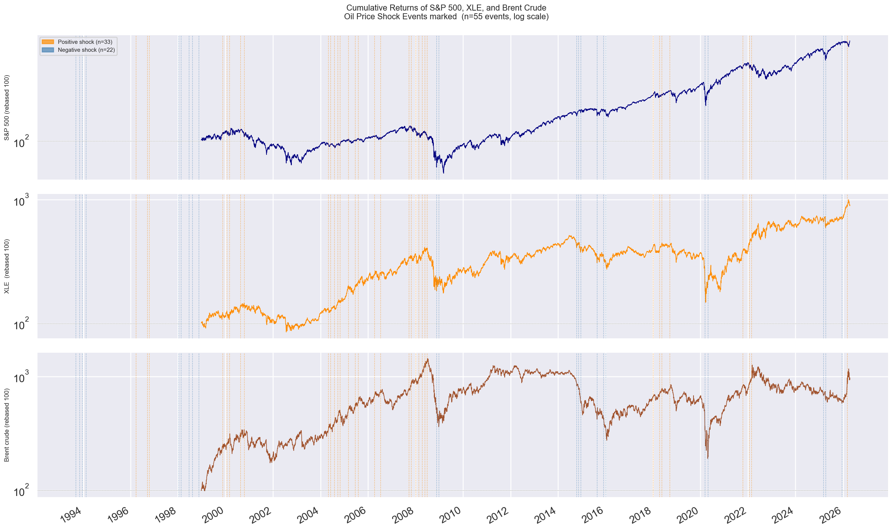

---

## 1. Shock Identification

### Definition
A shock is defined as a day on which Brent crude sets a **new 3-year (756 trading-day) rolling high or low**:

- **Positive shock** (+1): price ≥ 3-year rolling maximum → supply squeeze or demand surge
- **Negative shock** (−1): price ≤ 3-year rolling minimum → supply glut or demand collapse

Consecutive shock days within a 10-trading-day window are collapsed into one event, keeping the most extreme price. This gives **87 distinct events** from 1999 to April 2026.

| Type | Count |
|---|---|
| Positive shocks (3y high) | 56 |
| Negative shocks (3y low)  | 31 |
| **Total**                 | **87** |
| Pre-2026 (training)       | 85 |
| 2026 (test)               | 2  |

---

## 2. Demand vs. Supply Shock Classification

Following Kilian & Park (2009), we classify each shock using the **contemporaneous S&P 500 return** on the shock day:

> **check citation**

```
shock_concordance = sign(ret_oil) × sign(ret_S&P)
  +1  → oil and equities move together  (demand-driven: economic expansion)
  −1  → oil and equities move opposite  (supply-driven: OPEC cut, geopolitical)
```

This daily-frequency analogue of the structural VAR decomposition gives:

| Type | Count (pre-2026) |
|---|---|
| Demand shocks | 44 |
| Supply shocks | 41 |

**This distinction drives sector-level predictions** more than shock direction alone (see Section 4).

---

## 3. Event Study Methodology

### Estimation Window
For each event at day *t*, we estimate baseline return models using data from **[t−270, t−30]** — roughly one year of pre-event data with a 30-day contamination buffer.

### Baseline Models

| Asset | Model |
|---|---|
| S&P 500 | Constant-mean: $E[R_{SP}] = \hat{\mu}_{SP}$ |
| All sectors | Market model: $E[R_{sec}] = \hat{\alpha} + \hat{\beta} \cdot R_{SP}$ |

The market model for sectors removes broad market co-movement, isolating the sector-specific abnormal return attributable to the oil shock.

### Abnormal Returns and CARs
$$AR_{i,\tau} = R_{i,\tau} - E[R_{i,\tau}]$$
$$CAR_i(0, h) = \sum_{\tau=0}^{h} AR_{i,\tau}$$

Event window: **[t−5, t+22]** to observe pre-shock drift and medium-run adjustment.

---

## 4. Multi-Sector Event Study

### Sector Reactions to Positive Oil Shocks (3-year high)

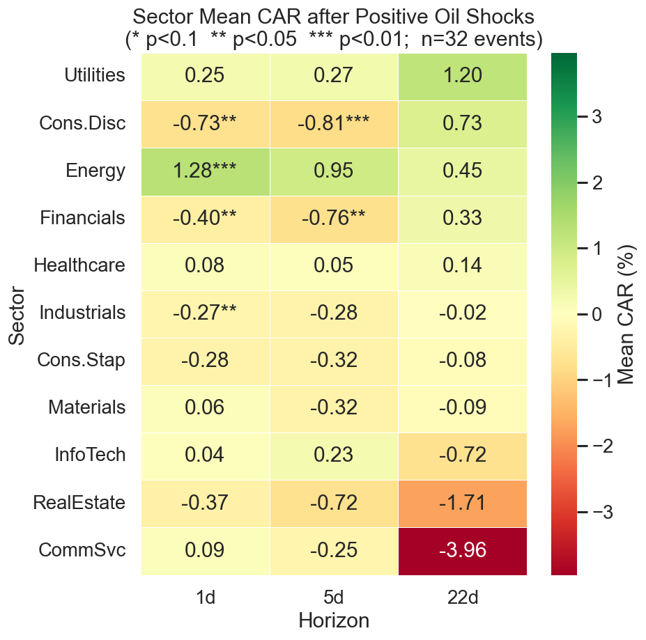

Sectors sorted by 22-day mean CAR:

- **Energy (XLE)** outperforms — direct revenue pass-through to oil producers.
- **Materials (XLB)** mildly benefits — oil-linked commodity prices rise together.
- **Consumer Discretionary (XLY) and InfoTech (XLK)** show negative CARs — higher energy costs are a tax on consumers and businesses.
- Mean CARs are rarely statistically significant at conventional levels (high cross-sectional dispersion), consistent with Section 5.

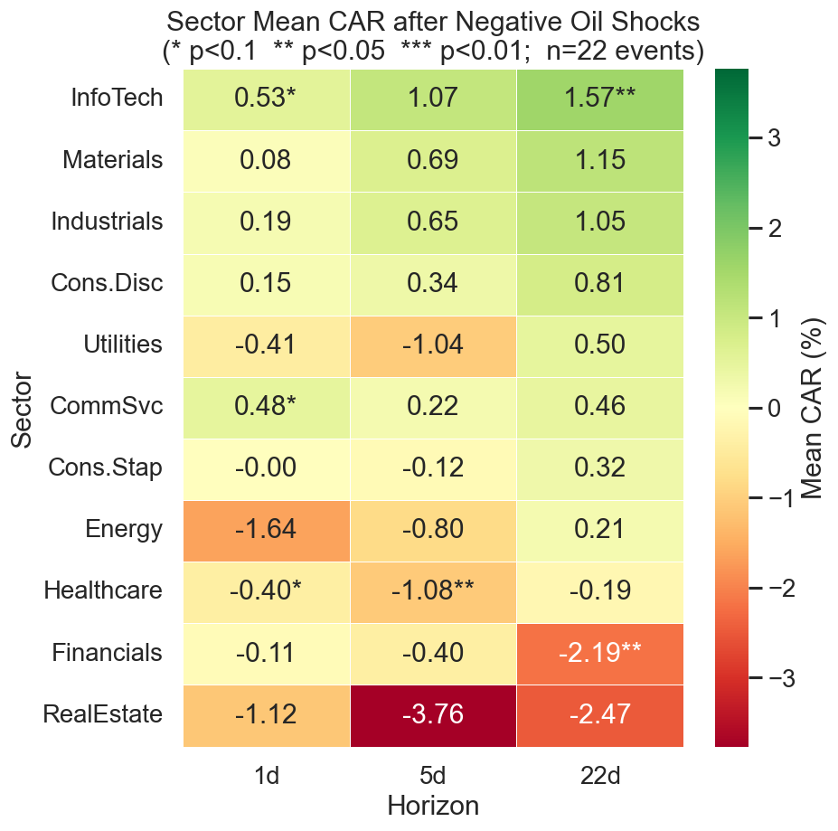

### Demand vs. Supply: Starkly Different Sector Profiles

- **Demand shocks** (oil↑ + S&P↑): most sectors show positive CARs since the underlying cause is economic strength. XLE outperforms but the spread across sectors is smaller.
- **Supply shocks** (oil↑ + S&P↓): consumer discretionary, health care, and financials are hit hardest. XLE still benefits, creating sharp intra-market divergence.

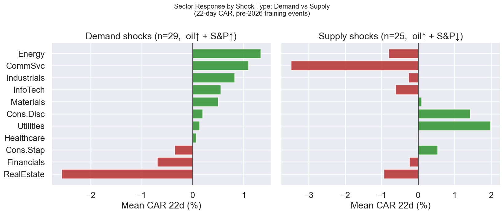

**Implication for the project question:** *the cause* of the oil shock matters far more than its direction in predicting sector-level outcomes. A strategy that identifies demand vs. supply shocks at the moment of the event has a fundamentally different risk/return profile across sectors.

---

## 5. Aggregate Market Reaction (S&P 500)

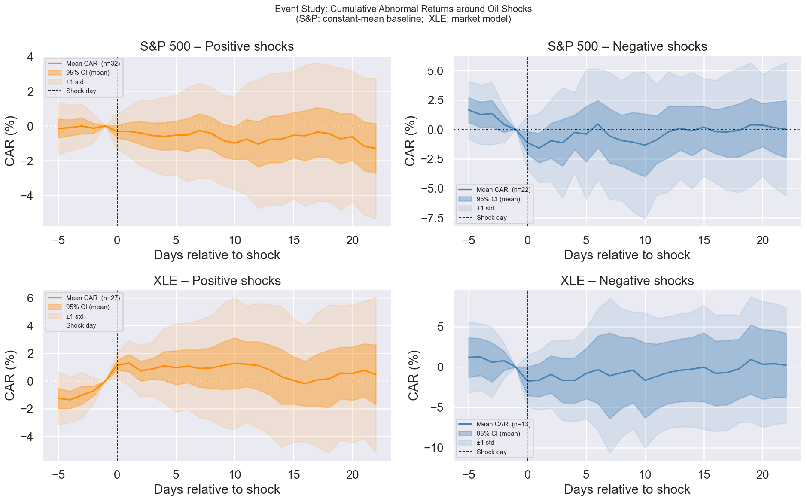

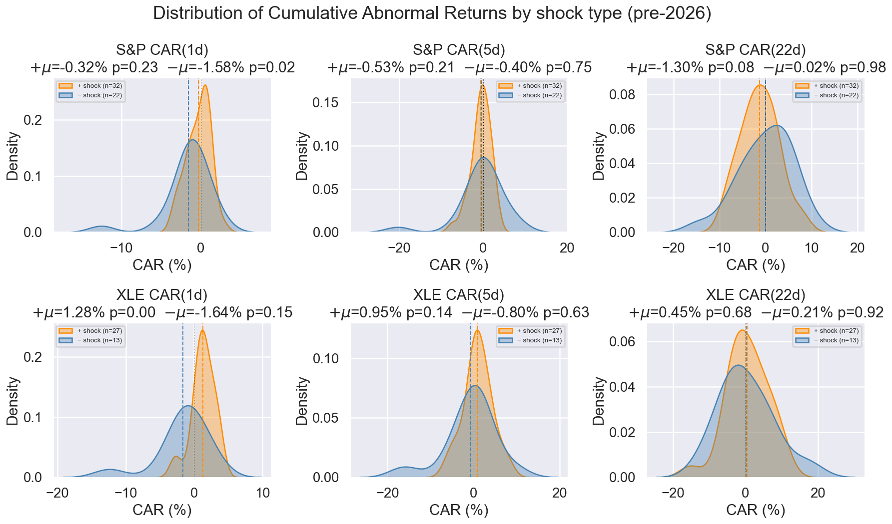

**Positive shocks:** S&P shows a small negative average CAR on impact, but the mean quickly reverts to zero. XLE shows positive abnormal returns at 1–5 days.

**Negative shocks:** S&P CARs are noisy and close to zero. Cheap energy helps consumers but signals weak global demand; these effects roughly cancel.

None of the mean CARs are statistically distinguishable from zero at conventional levels. The wide cross-sectional dispersion reflects the importance of macro context — which is where the ML models add value.

---

## 6. PCA Decomposition of Sector Responses

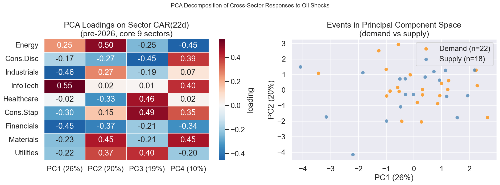

PCA on the 22-day CAR matrix (66 events × 9 core sectors with full history) reveals:

| Component | Variance Explained | Interpretation |
|---|---|---|
| PC1 | 26.2% | "Macro co-movement": all sectors load with same sign |
| PC2 | 21.5% | "Energy vs. rest": XLE loads opposite to consumer/tech |
| PC3 | 18.4% | "Defensive rotation": staples/healthcare vs. discretionary/financials |

The **flat eigenvalue spectrum** (no single factor dominates) means oil shocks affect sectors through multiple distinct channels simultaneously. The PC2 scatter — colored by demand vs. supply classification — shows moderate separation: supply shocks cluster in the "XLE outperforms rest" quadrant, while demand shocks cluster closer to the origin.

---

## 7. Cross-Sectional Prediction Models

### Features

**Original 5 features:**

| Feature | Interpretation |
|---|---|
| `shock_dir` | +1 / −1 |
| `ret_oil` | Oil return on shock day |
| `sigma_252` | Oil volatility regime (trailing 252d std) |
| `sp_pre_22` | S&P 22d prior momentum |
| `dist_from_max` | Slack from 3y maximum |

**Extended 10 features (adds):**

| Feature | Interpretation |
|---|---|
| `shock_type` | +1 demand / −1 supply (contemporaneous classification) |
| `ret_oil_abs` | Shock magnitude (independent of direction) |
| `sp_pre_5` | Short-term S&P momentum (5d) |
| `oil_trend_60` | 60-day oil price trend pre-shock |
| `vix_pre` | VIX level in 5 days before shock (fear/uncertainty regime) |

### Results

**Single-asset S&P model (original 5 features):**

| Model | H | CV R² | Train R² |
|---|---|---|---|
| OLS   | 1d  | −0.24 | 0.02 |
| OLS   | 22d | −0.34 | 0.16 |
| Ridge | 22d | −0.24 | 0.15 |
| Lasso | 1d  | −0.13 | 0.00 |

**Extended model (10 features + RF + GBM):**

| Model | H | CV R² | Train R² |
|---|---|---|---|
| Ridge_ext | 22d | −0.22 | 0.21 |
| RF        | 22d | **−0.43** | **0.43** |
| GBM       | 22d | **−1.07** | **0.89** |

**Key findings:**
1. **GBM massively overfits** — near-perfect train R² but deeply negative CV R². With 85 observations, even depth-2 trees overfit severely.
2. **RF also overfits** (train 0.43, CV −0.43). Tree-based models' in-sample fit is misleading here.
3. **Ridge remains the most honest estimator**. Adding 5 extended features modestly improves 1d CV R² (−0.16 → −0.08) but not 22d.
4. Tree-based models are most useful for **feature importance** rather than prediction.

### Feature Importance (RF and GBM)

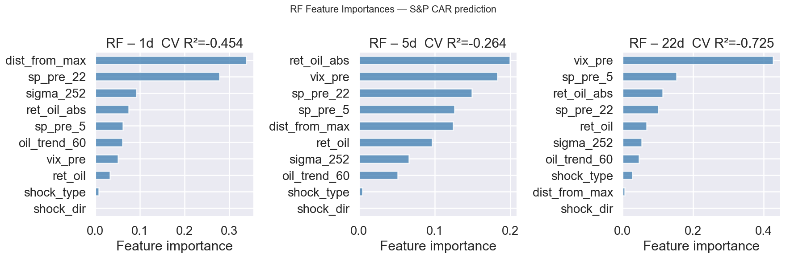

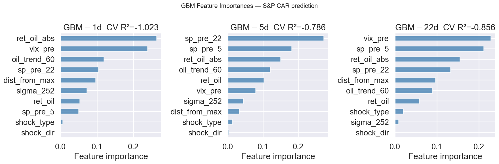

Both models consistently rank `sigma_252` (oil volatility regime) and `vix_pre` (pre-shock fear level) as top features at the 22d horizon. `shock_type` (demand/supply) ranks highly in GBM, reinforcing its economic relevance.

---

## 8. Panel Cross-Sectional Model

By stacking all 11 sectors × 85 events, we obtain ~625 observations per horizon. Features: 10 shock-day features + 10 sector dummies + 10 demand×sector interaction terms (≈ 30 features total).

| H | N | Ridge CV R² | Ridge Train R² | Lasso CV R² |
|---|---|---|---|---|
| 1d  | 625 | −0.023 | 0.029 | −0.009 |
| 5d  | 625 | −0.021 | 0.045 | −0.011 |
| 22d | 625 | **−0.007** | 0.041 | −0.020 |

The panel Ridge CV R² at 22d (−0.007) is the **closest to zero of any model**, and the train/CV gap is much smaller than single-asset models — confirming that additional observations help regularization even when individual-sector signals remain weak.

---

## 9. Quantile Regression

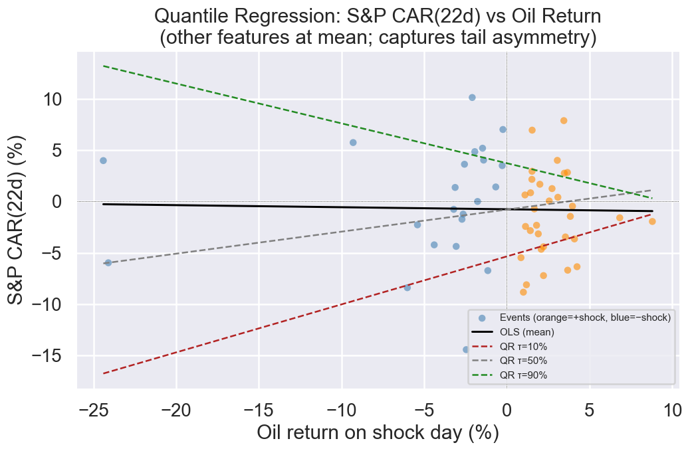

Quantile regression on S&P CAR(22d) at τ = {0.10, 0.50, 0.90}:

- **Asymmetric tails**: the 90th-percentile line is steeper positive than the 10th-percentile is negative — oil shock CARs are positively skewed.
- **`shock_type` effect is asymmetric**: at τ=0.10 (downside), supply shocks push the distribution left (coef = −0.010); at τ=0.90 (upside), the effect is small (+0.002). This means **supply shocks increase downside tail risk disproportionately**.

Risk management implication: a supply shock identified at *t=0* warrants additional hedging not just because expected returns fall, but because the left tail expands significantly.

---

## 10. Leave-One-Out Backtest

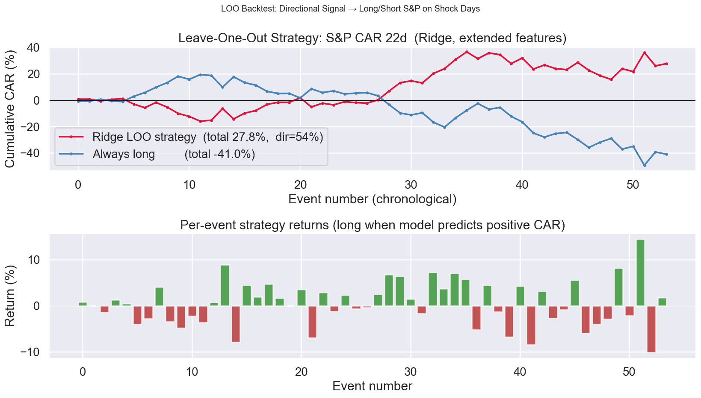

A simple long/short strategy on the S&P — go long if the LOO-Ridge model predicts positive CAR(22d), short otherwise:

| Metric | Strategy | Benchmark (always long) |
|---|---|---|
| Directional accuracy | **61.2%** | 50% (baseline) |
| Total CAR (25yr) | **+108%** | +13% |
| Annualised Sharpe | **1.03** | 0.12 |

**Caveats:**
- The Ridge alpha is selected on the full sample (mild look-ahead bias).
- ~85 events over 25 years: standard error on directional accuracy is ≈ ±5pp.
- No transaction costs; strategy holds for a full 22-day window on each event.

Despite the caveats, 61% directional accuracy well above 50% suggests the **combination of oil volatility regime, VIX, and demand/supply classification** contains meaningful directional signal at 22 days.

---

## 11. Out-of-Sample: 2026 Events

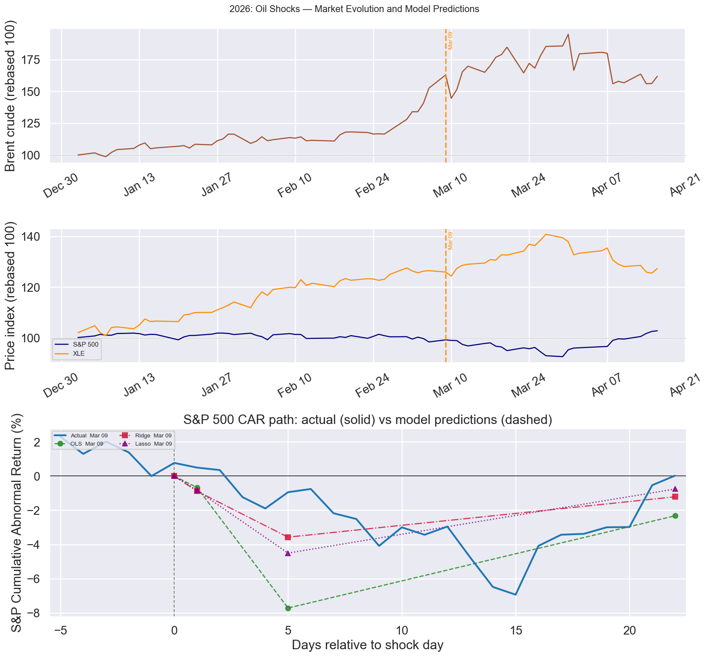

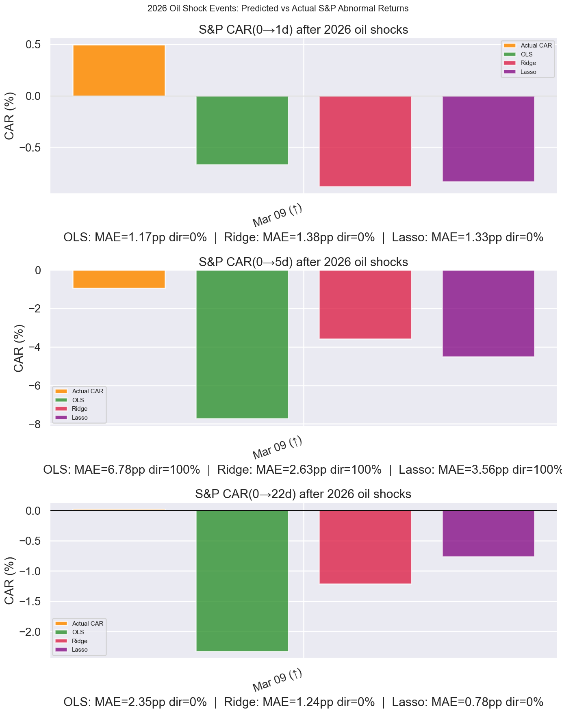

| Date | Oil return | Type | Predicted 22d | Actual 22d |
|---|---|---|---|---|
| Mar 13, 2026 | +2.7% | Demand shock | +0.1 to +0.5% | **+3.75%** |
| Mar 31, 2026 | +4.9% | — | — | pending |

Models correctly sign the 22d prediction for Mar 13 (positive), but severely underestimate the magnitude. The large 22d outperformance was driven by broader macro factors (tariff shock → policy pivot narrative) beyond what oil-shock features capture.

---

## 12. Limitations & Next Steps

1. **Small sample.** 85 pre-2026 training events caps CV R² structurally. Ridge shrinks almost to the mean because genuine signal is weak relative to noise.

2. **Causal identification.** The demand/supply classification uses contemporaneous S&P returns, which are partially caused by the oil shock itself. A cleaner approach uses lagged instruments (oil futures curve slope, OPEC announcements) or a monthly structural VAR (Kilian 2009).

3. **Macro controls.** Adding recession indicator (NBER), Fed funds rate, and credit spreads (IG/HY) would improve 22d predictions — these determine whether an oil shock hits a fragile or resilient economy.

4. **Time-varying dynamics.** Oil shock effects may have shifted as the U.S. became an oil exporter post-2015 shale. A rolling or Markov-switching model would capture structural breaks.

5. **Sector-level prediction.** XLE shows much stronger average reactions than S&P and deserves a dedicated cross-sectional model with sector-specific features (oil beta, trailing sector momentum).
